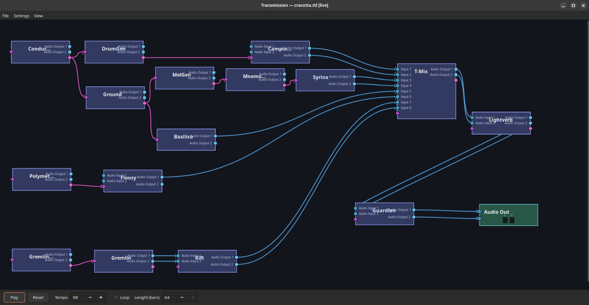

# Transmission

**A Generative Audio Workstation** 

Transmission hosts VST3 plugins in a directed graph, routes typed MIDI and audio between them, and exposes the full system to AI agents via the [Model Context Protocol](https://modelcontextprotocol.io). It is intended for use primarily with the [Downspout](https://danja.github.io/downspout/) VSY plugins.



## Features

- **Graph-based routing** — connect MIDI generators, processors, instruments, and effects in any topology; the scheduler computes a BFS execution order and runs independent nodes in parallel
- **VST3 hosting** — loads Linux VST3 bundles; embeds native plugin editors inside the GTK window via X11 socket
- **JACK / PipeWire** — real-time audio output with stable port naming across sessions
- **RDF/Turtle persistence** — projects saved as human-readable Turtle; plugin state stored as base64-encoded blobs within the graph
- **Offline rendering** — deterministic WAV export without a running JACK server
- **MCP control** — full graph and parameter control via the [Model Context Protocol](mcp-reference) and a [REST HTTP API](mcp-reference#http-api)
- **Autonomous plugins** — designed for use with [Downspout](https://github.com/danja/downspout), a suite of self-generating VST3 instruments and effects

## Quick start

```sh
git clone https://github.com/danja/transmission
cd transmission
npm install
./build.sh
./transmission
```

See [Installation](installation) for full requirements and build instructions.

## Documentation

| | |
|---|---|
| [Installation](installation) | Requirements, build steps, audio setup, troubleshooting |
| [User Guide](user-guide) | Graph editing, transport, console commands, offline rendering |
| [MCP Reference](mcp-reference) | MCP tools, resources, and HTTP API endpoints |
| [Architecture](architecture) | System design and component boundaries |
| [Plugin System](plugin-profiles) | VST3 discovery, curated profiles, RDF vocabulary |
